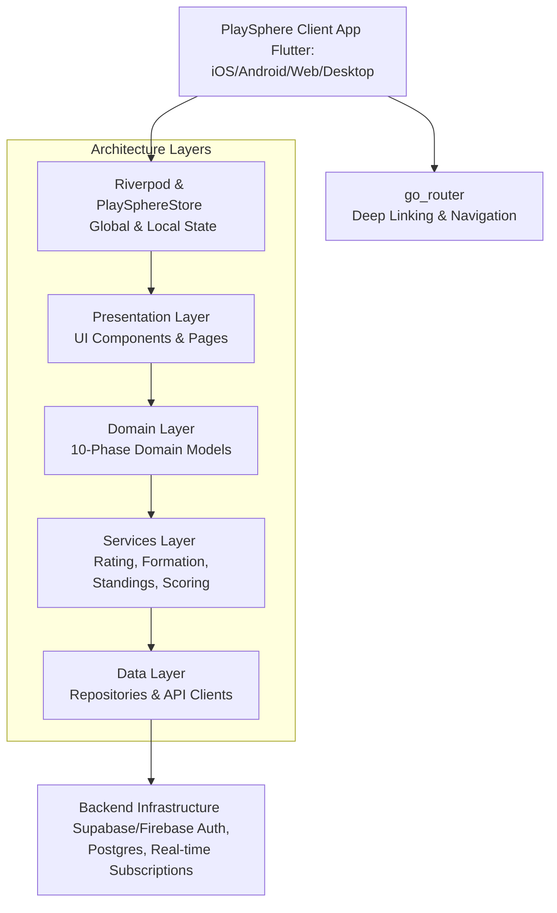

# 2. System Architecture

## 2.1 Overview

The PlaySphere platform is designed as a scalable, multi-tenant sports operating system. The primary goal of the system architecture is to provide a single, unified codebase that can be deployed across multiple platforms (iOS, Android, Web, and Desktop) while delivering high performance and a rich, offline-first (where applicable) user experience. 

The architecture follows a modular, feature-first design pattern to encapsulate related functionalities and ensure long-term maintainability. PlaySphere is fundamentally built using Flutter for the frontend, leveraging Riverpod for state management, and `go_router` for robust, deep-linkable navigation.



## 2.2 Frontend Architecture (Flutter)

PlaySphere leverages Flutter as its core UI toolkit, enabling a write-once, run-anywhere paradigm.

### 2.2.1 Multi-Platform Targeting
- **Mobile (iOS & Android):** The primary target for participants, providing localized experiences, push notifications, and quick access to live scoring and fixtures.
- **Web:** Targeting administrators and governing bodies for easier desktop-based data entry, tournament management, and reporting.
- **Desktop (macOS, Windows, Linux):** Native desktop builds for enterprise administration and venue management where dedicated hardware is utilized.
- **Design System:** Built exclusively on **Material 3 (M3)**, utilizing dynamic color schemes and adaptive layouts to ensure the UI gracefully scales from small smartphone screens to large desktop monitors.

### 2.2.2 State Management (Riverpod)
The application state is managed using **Riverpod**. The state architecture is designed around a central `ChangeNotifier`-based store (`PlaySphereStore`) for critical global states, combined with localized providers.

- **PlaySphereStore:** Manages session-level data, such as the current active user, selected organization context, and current role (Admin vs. Participant).
- **Role Switcher:** A core feature embedded in the state layer that seamlessly toggles the UI and permissions between Admin and Participant modes within the same app instance without requiring re-authentication.
- **Skip-Login Mode:** A specialized development and testing mode injected via state providers to allow developers to bypass authentication flows and rapidly test different roles and organizational contexts.

### 2.2.3 Routing and Deep Linking (go_router)
Navigation is strictly handled by `go_router`, enabling declarative routing and robust deep linking. This is critical for sharing specific entities (like a match or a player profile) across platforms.

**Key Route Structures:**
- `/org/:orgId` (Organization Dashboard)
- `/org/:orgId/events/:eventId` (Tournament/Event Details)
- `/org/:orgId/members/:memberId` (Player/Member Profile)
- `/org/:orgId/fixtures/:fixtureId` (Live Match Scoring)
- `/discovery` (Global Search and Event Discovery)

## 2.3 Domain Layer (10-Phase Model)

The core business logic and entities of PlaySphere are modeled around a comprehensive 10-phase domain structure, ensuring separation of concerns and clear data hierarchies.

1. **Identity & Roles:** Users, Organization Memberships, Multi-tenant Organization Contexts (Country > State > District > Community).
2. **Season & Competition:** Seasons, Sport Competitions, Stages (e.g., Group Stage, Knockouts), and Pools.
3. **Team Formation:** Rosters, Draft Pools, Snake Draft allocations, Franchise Auctions, and House-wise grouping.
4. **Fixtures & Scoring:** Match generation, scheduling, and sport-specific scoring plugins.
5. **Rating & Achievement:** ELO calculation engines, leaderboards, and portable player resumes.
6. **Trust & Safety:** Minor protection (guardian links), identity verification tiers (casual vs. sanctioned matches), and blocklists.
7. **Promotion Pipeline:** Hierarchical progression tracking (e.g., Community → District → State) via linked seasons.
8. **Discovery:** Search indexes for open tournaments, local leagues, and organizations.
9. **Venue & Officiating:** Facility management, court scheduling, referee assignments, and equipment tracking.
10. **Governance & Monetization:** Sanctioning workflows, fee collection, subscriptions, and financial reporting.

## 2.4 Service Layer & Core Engines

The Services layer contains the heavy-lifting algorithms and specialized business logic required to run a sports operating system.

### 2.4.1 Rating Calculation Engine (ELO)
A dynamic rating service implemented per sport.
- **Formula:** Expected(A) = 1 / (1 + 10^((RB - RA) / 400))
- **Adaptability:** Variables like the K-factor adjust based on the verification tier (casual vs. sanctioned) and the importance of the tournament.

### 2.4.2 Team Formation Engine
An AI-assisted service that automates the creation of balanced teams based on player ELO, age, and historical performance.
- **Algorithms Supported:**
  - AI Balanced Snake Draft (distributes talent evenly).
  - Franchise Auctions (virtual currency bidding systems).
  - House-wise / Faction-based grouping (schools/colleges).
  - Pure Randomization.

### 2.4.3 Sport Scoring Plugins
A modular interface that allows specific scoring logic to be plugged into the generic Fixture model.
- **Supported Plugins:** Cricket, Chess, Carrom, Badminton, Football, Volleyball, Basketball, Kabaddi.
- Each plugin dictates the state machine of a match (e.g., innings in cricket, sets in badminton) and the UI required for the live scoring terminal.

### 2.4.4 Promotion Pipeline & Standings Calculator
- **Standings:** Continuously aggregates match results to update league tables, net run rates, goal differences, etc.
- **Promotion:** Evaluates end-of-season standings against predefined criteria to automatically generate invitations or upgrade teams/players to higher-tier organizations (e.g., District to State).

## 2.5 Backend Architecture (Target State)

While the frontend is highly decoupled, the target backend architecture is designed to support immense scale and real-time interactions.

- **Authentication:** Supabase or Firebase Auth handling social logins, OTPs, and enterprise SSO.
- **Database:** PostgreSQL (via Supabase or custom deployment), utilizing Row Level Security (RLS) to strictly enforce multi-tenant boundaries (users can only access data for organizations they belong to).
- **Real-Time Engine:** Websocket subscriptions via Supabase/Firebase Realtime Database to push live scoring updates, draft picks, and chat messages to thousands of connected clients instantly.
- **File Storage:** S3-compatible storage for profile pictures, team logos, and digital certificates.

## 2.6 Folder Structure & Code Organization

The codebase strictly adheres to a feature-driven folder structure to maintain clarity as the system grows.

```text
lib/
├── app/                  # Application bootstrap, go_router config, global providers, theme config
├── core/                 # Low-level utilities: API clients, error handling, logging, local storage
├── domain/               # 10-Phase Domain Model definitions (Entities, Enums, Value Objects)
├── features/             # Feature modules (e.g., authentication, team_formation, live_scoring)
│   └── feature_name/
│       ├── data/         # Repositories and DTOs
│       ├── logic/        # Riverpod providers, StateNotifiers, UseCases
│       └── presentation/ # Widgets, Pages, Dialogs specific to the feature
└── shared/               # Reusable UI components (buttons, cards), helper functions, constants
```
