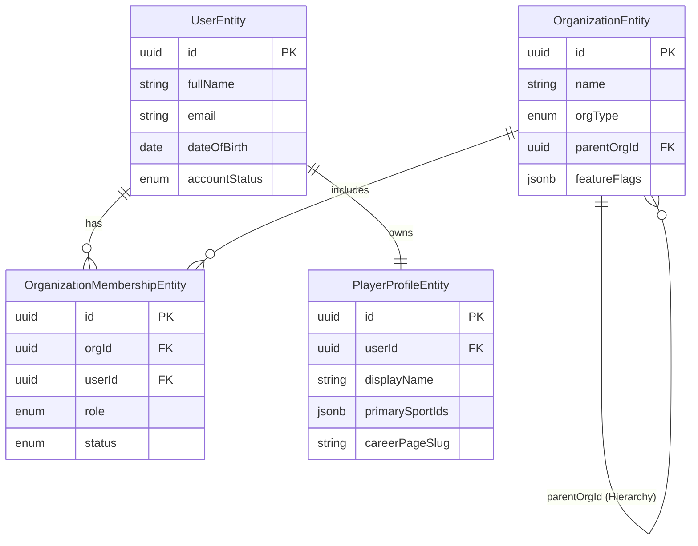
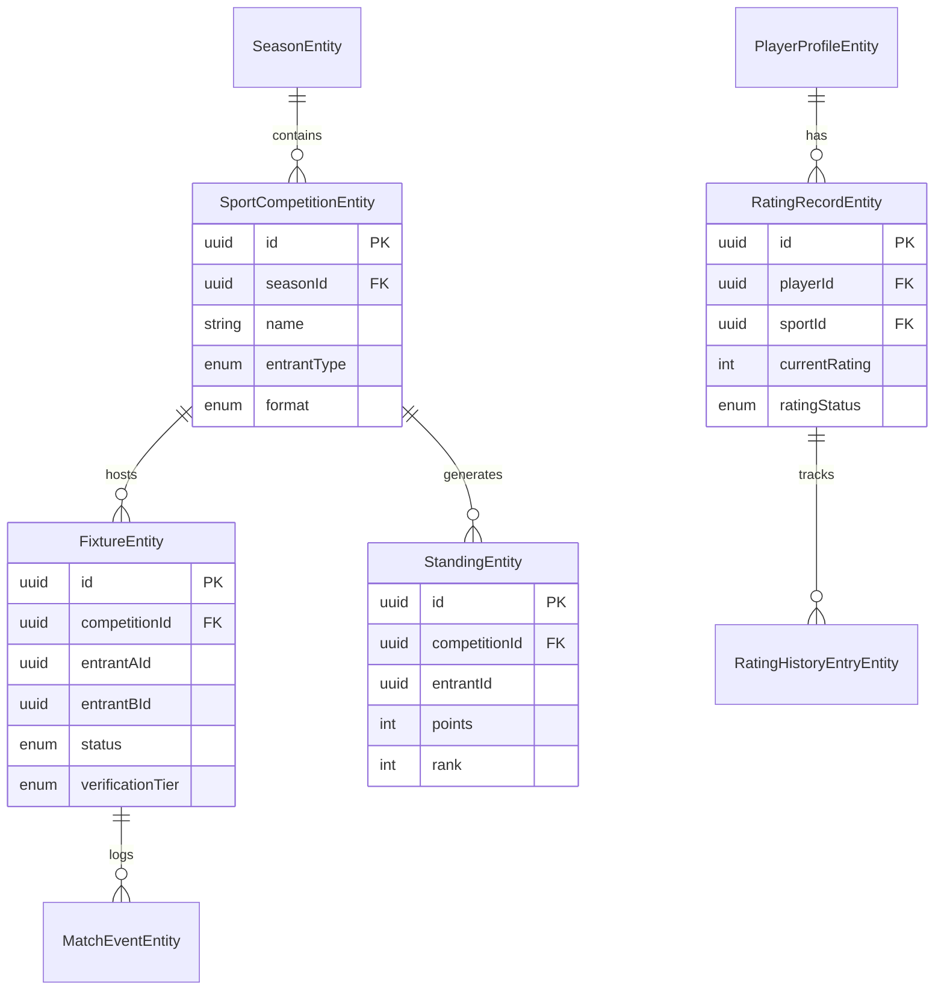

# 3. Database Design Specification

## 3.1 Overview
This document outlines the conceptual and logical database design for PlaySphere, a multi-tenant sports operating system. The data model is designed to support the nested organizational structure, comprehensive season management, dynamic team formation, per-sport rating engines (ELO), and robust trust & safety features. The core database technology chosen is PostgreSQL, reflecting the relational nature of the primary domain model, supplemented with NoSQL features (JSONB) for flexible sports scoring plugins and feature flags.

## 3.2 Domain Model Mapping (The 10 Phases)

The data model is segmented into ten logical phases corresponding to the functional domains of the application.

### Phase 1 - Identity & Multi-tenancy
Handles user accounts, multi-tenant organizational structure, and role-based access control.

*   **UserEntity**: Core user account. Fields: `id`, `fullName`, `email`, `dateOfBirth`, `authProvider`, `accountStatus`.
*   **OrganizationEntity**: Hierarchical tenant entity. Fields: `id`, `name`, `slug`, `orgType` (residentialCommunity, school, corporate, cityClub, districtAssociation, stateCouncil, countryCouncil), `parentOrgId`, `featureFlags` (JSONB), `orgVerificationStatus`.
*   **OrganizationMembershipEntity**: Links users to orgs with RBAC. Fields: `id`, `orgId`, `userId`, `role` (owner, admin, eventManager, judgeScorer, member), `status`, `membershipTag`.
*   **PlayerProfileEntity**: Portable cross-tenant profile. Fields: `id`, `userId`, `displayName`, `primarySportIds`, `visibilityDefault`, `careerPageSlug`.

### Phase 2 - Season & Competition Management
Manages the temporal structure of sporting events.

*   **SeasonEntity**: Overarching event block. Fields: `id`, `orgId`, `name`, `status` (draft, registrationOpen, registrationClosed, inProgress, completed, cancelled).
*   **SportCompetitionEntity**: Sport-specific contest within a season. Fields: `id`, `seasonId`, `sportId`, `name`, `entrantType` (individual, team), `format` (roundRobin, knockout, swiss, groupThenKnockout, leagueTable), `pointsConfigId`, `status`.
*   **RegistrationEntity**: Player/team sign-ups for a season/competition.
*   **PointsConfigEntity**: Configures standings arithmetic. Fields: `winPoints`, `drawPoints`, `lossPoints`, `tiebreakerOrder` (JSONB).

### Phase 3 - Team Formation & Roster Management
Manages how players are grouped into teams, supporting complex modes like auctions and drafts.

*   **TeamEntity**: Group of players. Fields: `id`, `orgId`, `teamKind` (adHoc, franchise), `name`.
*   **TeamMembershipEntity**: Player assignment to a team.
*   **TeamFormationStrategyEntity**: Rules for forming teams (e.g., snake draft config).
*   **FranchiseRosterEntryEntity**: Specific mapping for auction/franchise systems.
*   **AuctionLotEntity**: For franchise auctions. Fields: `id`, `teamId`, `playerId`, `basePrice` (in Paise), `status` (upcoming, live, sold, unsold).

### Phase 4 - Fixtures, Scoring & Standings
Execution phase of a competition.

*   **StageEntity**: Represents a phase (e.g., Group Stage, Quarter Finals).
*   **FixtureEntity**: A specific match. Fields: `id`, `competitionId`, `stageId`, `entrantAId`, `entrantBId`, `status` (scheduled, live, completed, walkover, abandoned, disputed), `verificationTier` (casual, sanctioned).
*   **MatchEventEntity**: Granular scoring events (e.g., goal, wicket, foul) via JSONB for sport-agnostic plugins.
*   **StandingEntity**: Dynamic table ranking. Fields: `played`, `wins`, `draws`, `losses`, `points`, `tiebreakValues` (JSONB), `rank`.

### Phase 5 - Rating Engine & Achievements
Core ELO calculation and historical tracking. Expected(A) = 1/(1+10^((RB-RA)/400)).

*   **RatingRecordEntity**: Current ELO per player per sport. Fields: `id`, `playerId`, `sportId`, `currentRating` (default 1200), `ratingStatus` (provisional, established, inactive).
*   **RatingHistoryEntryEntity**: Append-only ledger of ELO changes.
*   **AchievementEntity**: Milestone unlocked by player. Fields: `id`, `playerId`, `name`, `verificationTier`, `visibilityOverride`.
*   **FlaggedRatingEventEntity**: Suspicious match results requiring admin review before ELO application.

### Phase 6 - Trust & Safety
Protections for minors and verifiable relationships.

*   **GuardianLinkEntity**: Links adult to minor. Fields: `id`, `minorUserId`, `guardianUserId`, `relationship`, `verificationStatus`.
*   **ScoutingInviteEntity**: Controlled invitation mechanism for external scouting.

### Phase 7 - Promotion Pipeline
Cross-tier advancement (e.g., community champion -> district).

*   **SeasonLinkEntity**: Links a completed competition to a higher-tier upcoming competition to facilitate automatic qualification pipelines.

### Phase 8 - Discovery & Search
Entities optimized for scouting and matchmaking. (Mostly materialized views/ElasticSearch indexing from PlayerProfile, Ratings, and Location).

### Phase 9 - Venue & Officiating Management
*   **VenueEntity**: Physical location.
*   **VenueBookingEntity**: Time-slotted reservation for a fixture.
*   **OfficialCertificationEntity**: Umpire/Referee qualification levels.

### Phase 10 - Governance & Monetization
*   **TicketEntity**: Entry passes for specific fixtures/seasons.
*   **SponsorshipEntity**: Banner/brand placement tracking per organization/season.

## 3.3 Entity Relationship Diagrams (ERD)

### Core Identity & Multi-Tenancy (Phase 1)

### Competitions, Fixtures & Ratings (Phase 2, 4, 5)

## 3.4 Database Constraints & Rules

1.  **Hierarchical Integrity**: `OrganizationEntity.parentOrgId` cannot create cyclical loops. Checked via recursive CTE or application logic on insert/update.
2.  **Unique Identifiers**: `OrganizationEntity.slug` and `PlayerProfileEntity.careerPageSlug` must be strictly unique to allow clean URL routing.
3.  **ELO Rating Floor**: A check constraint ensures `RatingRecordEntity.currentRating` cannot drop below a predefined baseline (e.g., 100).
4.  **Minors Protection**: `UserEntity.dateOfBirth` triggers age calculation. If < 18, `accountStatus` may remain restricted until a verified `GuardianLinkEntity` is established.
5.  **Fixture Consistency**: `FixtureEntity.entrantAId` != `FixtureEntity.entrantBId`.
6.  **Ledger Immutability**: `RatingHistoryEntryEntity` and `MatchEventEntity` tables are append-only. Triggers or application-level rules prevent updates or deletes on historical logs.

## 3.5 Indexing Strategy

To support massive multi-tenant scale and real-time ELO lookups, the following index structures are required:

| Table | Index Columns | Index Type | Rationale |
| :--- | :--- | :--- | :--- |
| `OrganizationMembershipEntity` | `(orgId, userId)` | Unique B-Tree | Prevent duplicate memberships; speed up RBAC checks. |
| `OrganizationEntity` | `(parentOrgId)` | B-Tree | Optimize hierarchy traversals (finding all children of a state org). |
| `OrganizationEntity` | `(slug)` | Unique B-Tree | Fast tenant resolution via URL routing. |
| `RatingRecordEntity` | `(sportId, currentRating DESC)` | B-Tree | Top N leaderboards per sport; crucial for scouting. |
| `FixtureEntity` | `(competitionId, status)` | B-Tree | Quick loading of live or upcoming matches for a season. |
| `MatchEventEntity` | `(fixtureId, created_at)` | B-Tree | Chronological reconstruction of match timelines. |
| `PlayerProfileEntity` | `(displayName)` | Trigram (GIN) | Fuzzy search for talent discovery (Phase 8). |

## 3.6 Data Migration Strategy

1.  **Schema Versioning**: Use migration tools (e.g., Flyway, Prisma, TypeORM migrations) to maintain strict version control of the database schema.
2.  **Plugin Upgrades**: Sport scoring plugins (Phase 4) rely on JSONB in `MatchEventEntity`. Migrating scoring logic requires writing backwards-compatible serializers/deserializers in the application layer rather than massive JSONB rewriting in the DB.
3.  **Tenancy Isolation**: Use logical separation via `orgId` foreign keys on all top-level operational entities. Row-Level Security (RLS) in PostgreSQL will be evaluated for strict data isolation compliance in later phases.
4.  **Archival**: Historical seasons (`SeasonEntity.status = 'completed'`) and their corresponding fixtures/events older than 3 years will be partitioned and eventually moved to cold storage to keep active operational tables lean.
